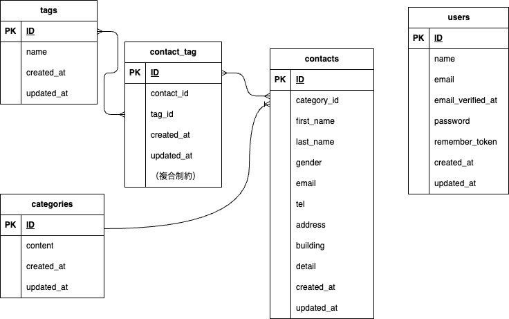

# COACHTECH お問い合わせフォーム (Contact form app)

## 概要
本アプリケーションは、Laravel 10.x および Laravel Sail 環境を用いた Traditional Web 構成のお問い合わせフォーム、管理画面（CSVエクスポート・タグCRUD機能）、および外部連携用REST API（V1）を備えたシステムです。
厳格な開発プロセスおよびコード品質基準（PSR-12準拠、Laravel Pintによる自動整形等）に則って実装されており、堅牢なテストスイート（全50テスト・205アサーション、総合コードカバレッジ約76.5%）を完備しています。

## ER図


## 環境構築手順

1. **リポジトリのクローンと移動**
```bash
git clone https://github.com/harada-0828/contact-form-app.git
cd contact-form-app

```

2. **環境変数の設定**
`.env.example` をコピーして `.env` ファイルを作成します。

```bash
cp .env.example .env

```

※ `.env` ファイルを開き、データベース接続情報が以下の設定になっていることを確認してください。

```env
DB_CONNECTION=mysql
DB_HOST=mysql
DB_PORT=3306
DB_DATABASE=laravel
DB_USERNAME=sail
DB_PASSWORD=password

```

**重要**: `DB_HOST` は localhost や 127.0.0.1 ではなく、Dockerコンテナ名である `mysql` を指定してください。

*(※Apple Silicon（M1/M2/M3 Mac）をお使いの方は、`compose.yaml` の `mysql` サービスに `platform: 'linux/amd64'` が設定されていることを確認してください)*

3. **Laravel Sail の起動とエイリアス設定**

```bash
./vendor/bin/sail up -d

# （任意）エイリアスの設定（Zshの場合）
echo "alias sail='[ -f sail ] && bash sail || bash vendor/bin/sail'" >> ~/.zshrc
exec $SHELL

```

4. **アプリケーションキーの生成**

```bash
sail artisan key:generate

```

5. **データベースのマイグレーションと初期データ投入**

```bash
sail artisan migrate --seed

```

*(※既存のデータベースをリセットしたい場合は `sail artisan migrate:fresh --seed` を実行してください)*

6. **フロントエンドの依存関係インストールとビルド**

```bash
sail npm install
sail npm run dev

```

**注意**: `sail npm run dev` は開発サーバーを起動したままにしておく必要があります。

7. **phpMyAdmin の追加（任意）**
データベースを確認したい場合は、`compose.yaml` の `mysql` サービスの次に行を追加してください。

```yaml
phpmyadmin:
  image: 'phpmyadmin:latest'
  ports:
    - '${FORWARD_PHPMYADMIN_PORT:-8080}:80'
  environment:
    PMA_HOST: mysql
    PMA_USER: '${DB_USERNAME}'
    PMA_PASSWORD: '${DB_PASSWORD}'
  networks:
    - sail
  depends_on:
    - mysql

```

8. **テストの実行**

```bash
sail artisan test

```

## シーディング仕様・テスト用ユーザ

`sail artisan migrate --seed` を実行することで、以下の初期データおよびテストデータが自動的に投入されます。

### 1. テスト用ユーザ (UserSeeder)

管理画面へのログインおよびフロントエンド認証に使用します。

* **ユーザ名**: Test User
* **メールアドレス**: `test@example.com`
* **パスワード**: `password`

### 2. 初期データ・ダミーデータ構成 (DatabaseSeeder)

以下の順番で各種シーダーが実行されます。

* **CategorySeeder** (`categories` テーブル): 固定5件
* 登録内容: 「商品のお届けについて」「商品の交換について」「商品トラブル」「ショップへのお問い合わせ」「その他」


* **TagSeeder** (`tags` テーブル): 固定5件
* 登録内容: 「質問」「要望」「不具合報告」「ご意見」「その他」


* **ContactSeeder** (`contacts` / `contact_tag` テーブル):
* Faker (`ja_JP`) を用いたリアルなダミーデータを **20件** 生成
* カテゴリは既存の `categories` からランダムに選択され `category_id` に紐付けられます。
* 各お問い合わせ（Contact）に対して、既存のタグからランダムに **1〜3件** が中間テーブル（`contact_tag`）に紐付けられます。


## 使用技術

* **OS**: Dockerが動作する任意のOS
* **Backend**: PHP 8.2, Laravel 10.x (Sail)
* **Database**: MySQL 8.0
* **Webサーバー**: Nginx
* **Frontend**: Vite, Tailwind CSS ^3.4.0, Alpine.js
* **Development & Quality Tools**: Docker, Laravel Sail, phpMyAdmin, Laravel Pint

## APIエンドポイント一覧 (V1)

*認証不要（Sanctum未使用）のパブリックAPIです。*

| メソッド | パス | 概要 |
| --- | --- | --- |
| `GET` | `/api/v1/contacts` | お問い合わせ一覧取得（検索・ページネーション対応） |
| `GET` | `/api/v1/contacts/{id}` | お問い合わせ詳細取得 |
| `POST` | `/api/v1/contacts` | お問い合わせ作成 |
| `PUT` | `/api/v1/contacts/{id}` | お問い合わせ更新 |
| `DELETE` | `/api/v1/contacts/{id}` | お問い合わせ削除 |

## 開発環境URL

* **アプリケーションURL**: `http://localhost`
* **phpMyAdmin**: `http://localhost:8080` （追加している場合）

## 作成者

Harada Naoki